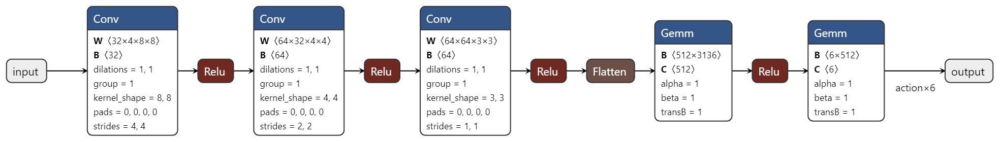

# Deep Q Networks

## 1. Training process

  

1. The process uses epsilon-greedy actions, where we will choose actions randomly
with a probability ε and greedily with probability (1-ε). The value of epsilon
starts at 1.0 and decreases gradually to a chosen minimum epsilon (0.01 or 0.1)
encouraging the agent to explore more at the start and exploit more as it gets
experience.

2. The agent samples from the environment with the chosen action and observes a
reward and next state.

3. Update the agent's replay buffer/memory with each step on the environment. We
prefill the memory by randomly playing a number of episodes before starting to
learn.

4. Pick a batch of tuples randomly from the memory and calculate the estimated
values of the next states using the target network(Q^) and taking the maximum
for each state. Calculate the targets(Y) by summing the rewards with the
discounted values we just calculated and calculate the gradients for updating
the online network(Q) where the error term is the squared difference between
the targets(Y) and the estimated values for the current states and actions using
the online network(Q)

5. Occasionally update the weights of the target network with the weights of the
online network to prevent divergence that may occur as a result of moving targets.

## 2. Q-Network architecture

  

The network makes use of a fully-connected convolution layer with inputs shape
(batch_size x 4(frames) x 84(height) x 84(width)) and two hidden convolution
layers to calculate features from raw pixels of the game. A flattening layer to
convert from the convolution layers to a fully-connected hidden linear layer.
The three convolution layers and the hidden linear layer are followed by
rectifier linear units (ReLu). We then have a fully-connected output layer with
the output equalling the number of actions(8) for the game.

## 3. Hyperparameters

| Name | Value | Description |
|:---|:---|:---|
| batch-size | 32 | Number of transition tuples that are representative of the world, higher values may be better representing |
| discount-factor | 0.99 | Discounts future rewards so that current rewards are slightly weighted higher that future rewards |
| env | PongNoFrameskip-v4 | Environment to train the agent (networks) |
| eps-end | 0.01 |  |
| eps-fraction | 0.1 |  |
| eps-start | 1.0 |  |
| learning-freq | 4 | How often we train the online network(Q) |
| learning-rate | 0.0001 |  |
| learning-starts | 50000 | When to start learning, only start learning when the replay buffer/memory is prefilled with transition tuples, the more time we wait the (limited by memory size) the better representative the buffer samples will be of the world |
| num-steps | 1000000 | How long to train the agent, the longer you train the better your agent gets (converges in the limit) |
| replay-buffer-size | 5000 | Number of previous transitions to remember |
| seed | 1 | Random number seeding |
| target-update-freq | 10000 | How often to copy the weights of the online network(Q) to target network(Q^), too small values may cause the Q values to diverge, too large values may cause the agent to converge towards a wrong state |
| use-double-dqn| False | Whether or not to use Double Deep Q-Networks (@see <https://arxiv.org/pdf/1509.06461.pdf>) |

## 4. Average rewards (100 episodes) per step

  

## 5. Loss per update

  

